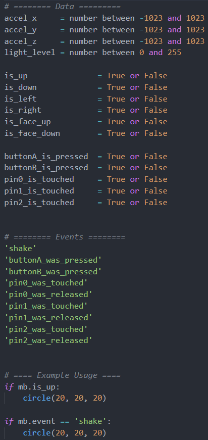

# Micro:bit to Processing Library

Custom library allowing for easy access to all data from Micro:bit inside of Processing.py.

## Installation

1. Upload `send_all_microbit_data.hex` file to your Micro:bit.

2. Place `mb.py` file into `libraries/site-packages` of your Processing folder.

3. Done! Your sketches now have access to the following variables and events:

